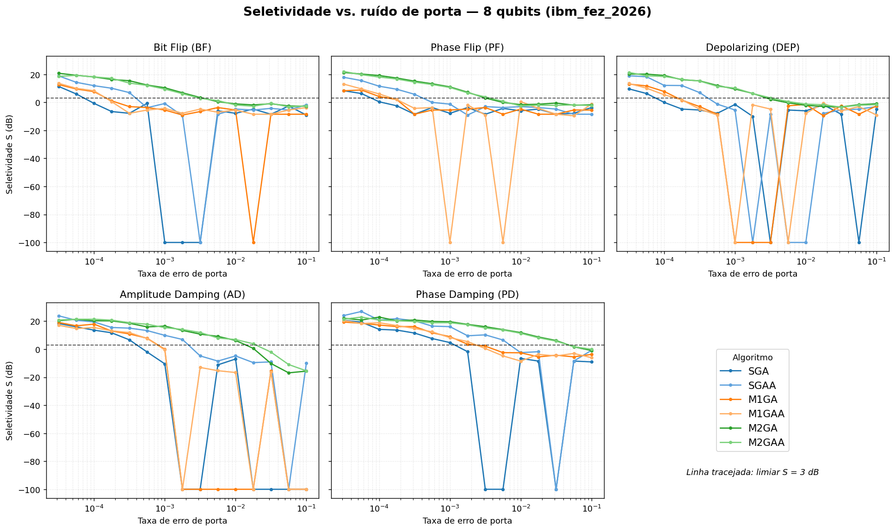
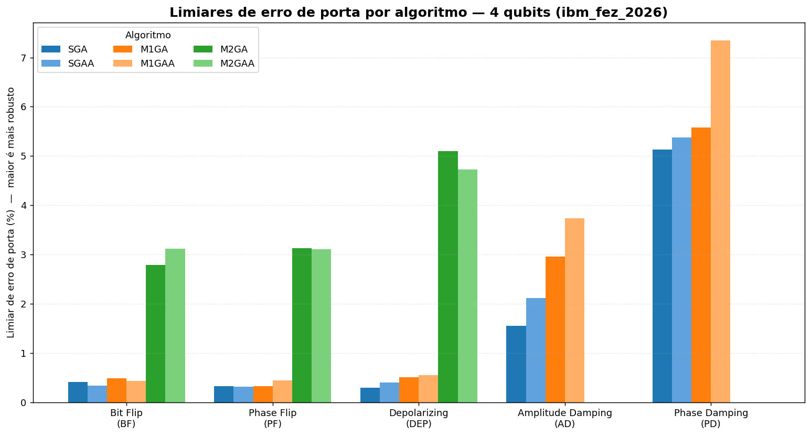
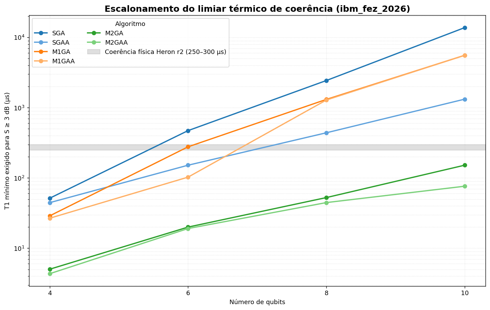
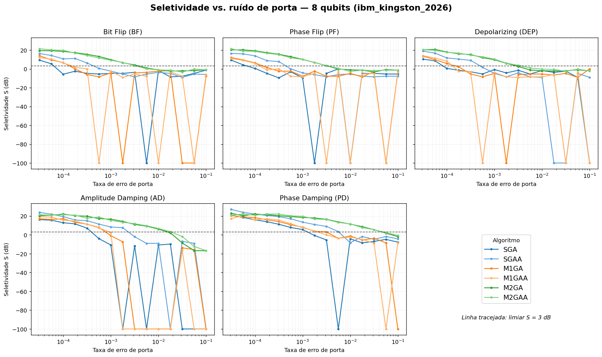
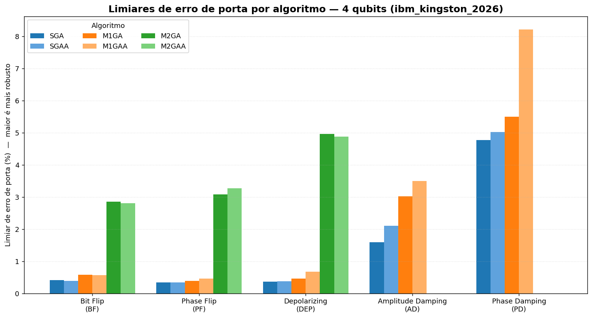
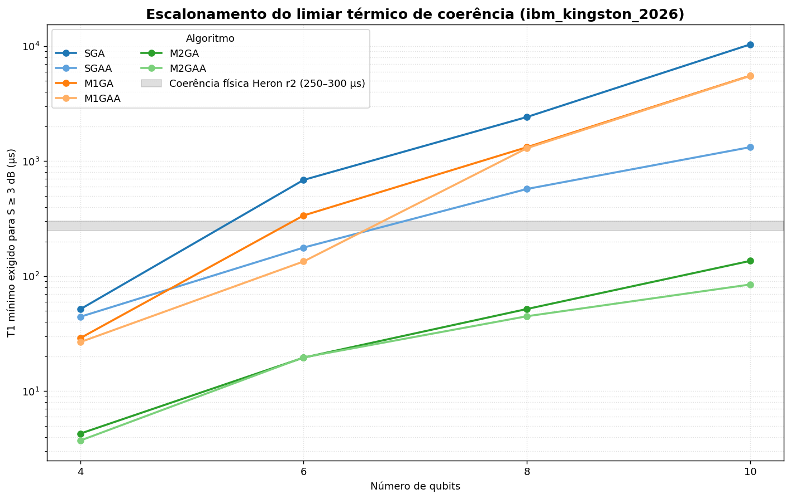

# Grover sob Ruído: Limiares de Seletividade em Hardware NISQ

[](LICENSE)
[](https://www.python.org/)
[](https://www.ibm.com/quantum/qiskit)
[](https://doi.org/10.1103/PhysRevA.102.042609)

Reprodução e modernização do estudo de limiares de ruído do algoritmo de busca de
Grover, baseado em:

> Y. Wang and P. S. Krstić, *"Multistate Grover search with noise"*,
> **Phys. Rev. A 102, 042609 (2020)**.
> DOI: [10.1103/PhysRevA.102.042609](https://doi.org/10.1103/PhysRevA.102.042609)

O projeto simula a busca de Grover sob diversos canais de ruído usando **Qiskit Aer**
e calcula o **limiar de seletividade**

$$S = 10 \log_{10}\!\left(\frac{P_t}{P_{hn}}\right)$$

onde `P_t` é a probabilidade de medir o estado-alvo e `P_hn` a maior probabilidade
entre os estados não-alvo. O critério de sucesso adotado é `S ≥ 3.0 dB`.

Além do perfil original do paper (`ibmq_cambridge_2020`), o estudo foi estendido para
processadores supercondutores modernos da IBM — **IBM Fez** e **IBM Kingston**
(arquitetura Heron r2) — comparando seis variantes do algoritmo de 4 a 10 qubits.

---

## Algoritmos avaliados

| Sigla   | Descrição                                                |
| :------ | :------------------------------------------------------- |
| `SGA`   | Grover padrão (Standard Grover Algorithm)                |
| `SGAA`  | Grover padrão com qubit auxiliar (ancilla)               |
| `M1GA`  | Grover local de 1 estágio (difusão local alternada)      |
| `M1GAA` | Grover local de 1 estágio com ancilla                    |
| `M2GA`  | Grover local de 2 estágios (prefixo + sufixo)            |
| `M2GAA` | Grover local de 2 estágios com ancilla                   |

Canais de ruído de porta: Bit Flip (`BF`), Phase Flip (`PF`), Depolarizing (`DEP`),
Amplitude Damping (`AD`) e Phase Damping (`PD`). Também é mapeado o limiar térmico
mínimo de coerência (`T1`/`T2`) necessário para manter `S ≥ 3.0 dB`.

---

## Estrutura do repositório

```
.
├── src/                     # Código-fonte
│   ├── grover_paper_repro.py    # Simulação principal (Qiskit Aer) — limiares de ruído e térmicos
│   ├── grover_paper_hardware.py # Execução em hardware real da IBM Quantum
│   ├── grover_origin.py         # Análise de limiar original do projeto
│   ├── run_experimentos.py      # Orquestrador multi-QPU (Fez + Kingston, com checkpoints)
│   ├── merge_results.py         # Pós-processamento e consolidação de resultados
│   └── plot_results.py          # Geração das figuras a partir dos dados consolidados
├── data/                    # Resultados (JSON / JSONL / CSV) por perfil de hardware
├── figures/                 # Figuras e gráficos gerados (PNG)
├── notebooks/               # Notebooks exploratórios
├── requirements.txt
└── README.md
```

Os scripts resolvem automaticamente os caminhos de leitura/escrita para `data/`,
independentemente do diretório de onde forem executados.

---

## Instalação

Requer Python 3.11+.

```bash
python -m venv .venv
source .venv/bin/activate
pip install -r requirements.txt
```

---

## Uso

### Simulação (Qiskit Aer)

Executar a varredura completa de limiares para um perfil de hardware:

```bash
# Perfil IBM Fez, 4 e 6 qubits
python src/grover_paper_repro.py --profile ibm_fez_2026 --qubits 4,6

# Apenas limiares de erro de porta
python src/grover_paper_repro.py --profile ibm_kingston_2026 --qubits 8 --only-error

# Apenas limiares térmicos (coerência T1/T2)
python src/grover_paper_repro.py --profile ibm_fez_2026 --qubits 10 --only-thermal
```

Perfis disponíveis: `ibmq_cambridge_2020`, `ibm_fez_2026`, `ibm_kingston_2026`.

### Orquestrador multi-QPU

Roda Fez e Kingston em sequência, com consolidação e checkpoints (pula configurações
já calculadas):

```bash
python src/run_experimentos.py --qubits 4,6,8,10
```

### Execução em hardware real (opcional)

O `grover_paper_hardware.py` submete circuitos a uma QPU real da IBM Quantum. O token
é lido de um arquivo separado e **nunca** é impresso ou salvo nos resultados:

```bash
# Token em ~/.config/ibm_quantum/token (padrão)
python src/grover_paper_hardware.py --backend ibm_fez
```

---

## Resultados principais

Varredura de 4 a 10 qubits sob os perfis IBM Fez e IBM Kingston.

- **Vantagem exponencial do Grover de 2 estágios (M2GA / M2GAA).** A exigência de
  coerência térmica em relação ao Grover padrão cai de ~12× (4 qubits) para
  **120–130× (10 qubits)**, reduzindo o `T1`/`T2` necessário de mais de 10 ms para
  apenas ~76–84 µs.
- **Viabilidade no Heron r2.** Com coerência física típica de 250–300 µs, o Grover
  padrão (SGA) é inviável a partir de 8 qubits (>2,4 ms exigidos), enquanto a família
  M2GA opera dentro da zona de segurança física, com margens de 3× a 11× a 10 qubits.
- **Robustez a ruído de porta.** A 4 qubits, o M2GA tolera ~4,5% de erro de
  depolarização, contra apenas ~0,30% do SGA.

> **Nota.** As pequenas flutuações nos algoritmos locais (`M1GA`/`M1GAA`) decorrem da
> natureza estocástica das simulações Monte Carlo sob `SHOTS` finitos.

### Visualização dos Resultados

As figuras a seguir foram geradas a partir dos dados consolidados na pasta `data/` usando o script `src/plot_results.py`:

#### Perfil IBM Fez (`ibm_fez_2026`)
* **Seletividade vs. Taxa de Erro (8 Qubits)**
  
* **Limiares de Erro de Porta (4 Qubits)**
  
* **Escalonamento do Limiar Térmico (4 a 10 Qubits)**
  

#### Perfil IBM Kingston (`ibm_kingston_2026`)
* **Seletividade vs. Taxa de Erro (8 Qubits)**
  
* **Limiares de Erro de Porta (4 Qubits)**
  
* **Escalonamento do Limiar Térmico (4 a 10 Qubits)**
  

---

## Formato dos dados (`data/`)

Para cada perfil (`ibm_fez_2026`, `ibm_kingston_2026`) há arquivos de duas famílias:

- `grover_thresholds_<perfil>.{jsonl,json,append.csv}` — limiares de erro de porta.
- `grover_thermal_thresholds_<perfil>.{jsonl,json}` — limiares térmicos (`T1`/`T2`).

Os `.jsonl` são append-only (um registro por configuração, robustos a interrupções em
execuções longas) e os `.json` são as versões consolidadas e ordenadas geradas pelo
pós-processamento.

---

## Licença

Distribuído sob a licença MIT — veja [`LICENSE`](LICENSE). O artigo de referência é
material de terceiros com direitos autorais e **não** está incluído no repositório;
consulte-o pelo DOI acima.
