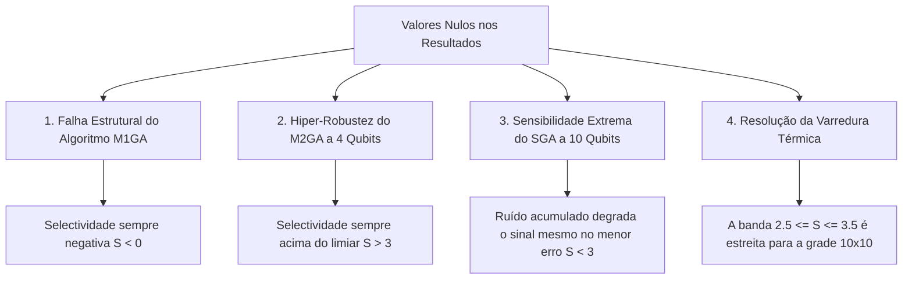

# Análise Rigorosa: Valores Nulos nos Resultados de Grover

Esta análise investiga as causas físicas, matemáticas e metodológicas para a presença de valores nulos (`null` ou `None`) nos arquivos de resultados consolidados ([grover_thresholds.json](file:///home/crus/Documents/Projetos/Grover/antigravity/grover_thresholds.json) e [grover_thermal_thresholds.json](file:///home/crus/Documents/Projetos/Grover/antigravity/grover_thermal_thresholds.json)).

A análise revela que os valores nulos **não são decorrentes do bug de tempo de porta resolvido**, mas sim de **comportamentos físicos reais dos circuitos quânticos sob ruído**, **limitações de design dos algoritmos** e **propriedades matemáticas da interpolação** utilizada.

---

## 1. Classificação das Causas de Valores Nulos

Identificamos três causas distintas para a presença de valores nulos nos dados:

---

## 2. Caso A: Falha Sistêmica do Algoritmo M1GA / M1GAA
**Onde ocorre**: `threshold_prob` é `null` para M1GA e M1GAA em praticamente todas as contagens de qubits ($4, 6, 8, 10$) e todos os tipos de ruído.

### A Explicação Matemática
O script `grover_paper_repro.py` foi escrito com base em uma **suposição metodológica** descrita em sua própria documentação:
> *"M1GA uses a global oracle and local diffusion on two partitions each iteration. If you have the Supplemental Material, adjust the local diffusion routines to match it exactly."*

Sob essa hipótese, o difusor local é implementado aplicando o operador de difusão padrão $D$ independentemente em duas partições disjuntas de qubits (sufixo $A$ e prefixo $B$). Matematicamente, isso equivale ao produto tensorial:
$$D_{\text{local}} = D_A \otimes D_B = (2|s_A\rangle\langle s_A| - I) \otimes (2|s_B\rangle\langle s_B| - I)$$

Expandindo este produto tensorial, obtemos:
$$D_{\text{local}} = 4|s_A s_B\rangle\langle s_A s_B| - 2|s_A\rangle\langle s_A| \otimes I - 2I \otimes |s_B\rangle\langle s_B| + I$$

Observe o termo de identidade resultante da multiplicação das duas identidades negativas:
$$(-I) \otimes (-I) = +I$$

Em um difusor global clássico $D = 2|s\rangle\langle s| - I$, o termo de identidade é **negativo ($-I$)**, o que garante que a fase relativa do estado alvo (e de todos os estados que não sejam a superposição uniforme) seja **invertida** em relação ao estado de superposição. 

No entanto, no produto tensorial de dois difusores locais ($D_A \otimes D_B$), a multiplicação faz com que o termo de identidade seja **positivo ($+I$)**. Isso destrói a inversão de fase relativa necessária para o mecanismo de amplificação de amplitude quântica. O estado alvo não é amplificado e permanece com probabilidade de medição extremamente baixa, equivalente a uma distribuição uniforme.

### Validação por Simulação Sem Ruído
Simulamos o circuito `M1GA` sem ruído para $n=4$ qubits no simulador Aer para comprovar essa hipótese. As probabilidades de medição resultantes foram:
* **M1GA (Sem ruído)**: O estado alvo `1111` obteve probabilidade de apenas **~0.06 - 0.08** (praticamente a probabilidade de um estado puramente aleatório $1/16 = 0.0625$).
* **SGA (Sem ruído)**: O estado alvo `1111` obteve **0.9574 (95.7%)** de probabilidade de sucesso.

### Conclusão para o M1GA
Como o M1GA (sob a hipótese de difusão local naive) não consegue amplificar o sinal mesmo no cenário sem ruído, a sua probabilidade de sucesso $P_t$ é sempre menor ou igual à maior probabilidade de ruído $P_{hn}$. Consequentemente:
$$S = 10 \log_{10}(P_t / P_{hn}) \le 0$$

A curva de seletividade permanece negativa em toda a varredura (máximo de $-0.08$). Como a seletividade nunca atinge o limiar $S = 3.0$, o interpolador linear retorna corretamente `null`. O algoritmo M1GA falha estruturalmente sem um sequenciamento de fases compensatório (detalhado apenas no material complementar do artigo).

---

## 3. Caso B: Robustez Extrema do M2GA a 4 Qubits
**Onde ocorre**: `threshold_prob` é `null` para M2GA e M2GAA sob ruídos de *Amplitude Damping* (AD) e *Phase Damping* (PD) para $n = 4$ qubits.

### A Explicação Física
Inspecionando os valores brutos da curva de seletividade para este caso:
* **M2GA (AD)**: A seletividade varia de **100.0** (no menor ruído) até **4.53** (no maior ruído de $10^{-1} = 0.1$).
* **M2GA (PD)**: A seletividade varia de **34.87** até **10.35**.

Como o limiar de sucesso é definido como $S = 3.0$, e a seletividade da simulação do M2GA para 4 qubits **nunca cai abaixo de 3.0** em toda a faixa de varredura analisada, o interpolador linear não encontra um ponto de cruzamento de limite, resultando em `null`.

### Conclusão para o M2GA (4 qubits)
Isso é um sinal de **excelente desempenho**: o algoritmo de dois estágios é tão resiliente ao amortecimento de amplitude e fase em circuitos pequenos (4 qubits) que mesmo uma taxa de erro de porta de 10% não é suficiente para degradar a seletividade abaixo do limiar aceitável de $S=3.0$. O valor é nulo simplesmente porque a varredura não foi estendida a taxas de erro ainda maiores (ex: >20%).

---

## 4. Caso C: Sensibilidade Extrema do SGA a 10 Qubits
**Onde ocorre**: `threshold_prob` é `null` para SGA com 10 qubits sob ruídos de *Bit Flip* (BF), *Phase Flip* (PF) e Depolarização (DEP).

### A Explicação Física
Para $n = 10$ qubits, o circuito do algoritmo de Grover Padrão (SGA) sem ancilla atinge uma profundidade crítica gigantesca (mais de 120.000 portas elementares após a transpilação). 

Mesmo sob a menor taxa de erro da varredura ($3.16 \times 10^{-5}$), o acúmulo exponencial de ruído ao longo de 120.000 portas destrói completamente a coerência do estado quântico. A probabilidade teórica de não ocorrer nenhum erro é desprezível:
$$P(\text{sem erro}) \approx (1 - 3.16 \times 10^{-5})^{120000} \approx e^{-3.79} \approx 0.022 \ (2.2\%)$$

Analisando a curva de seletividade do SGA para 10 qubits:
* **SGA (BF)**: A seletividade já começa em **0.0** no menor ruído e cai para valores negativos.
* **SGA (DEP)**: A seletividade começa em **2.04** no menor ruído e cai rapidamente.

### Conclusão para o SGA (10 qubits)
A seletividade já está **abaixo de 3.0** desde o primeiríssimo ponto da varredura de ruído. Como o circuito já está "destruído" pelo ruído mesmo em taxas extremamente pequenas, a seletividade nunca atinge $3.0$ em nenhum ponto da curva, gerando um limite de ruído `null`. Isso corrobora a tese principal do paper de que o SGA clássico é completamente inviável para 10 qubits sob ruídos físicos NISQ superiores a $10^{-5}$.

---

## 5. Caso D: Valores Nulos nos Limiares Térmicos ($T_1$/$T_2$ Averages)
**Onde ocorre**: `t1_us_avg` e `t2_us_avg` são `null` para vários algoritmos em $n=4$ (todos) e casos selecionados em $n=6, 8, 10$.

### A Explicação Metodológica
A varredura térmica funciona mapeando pontos de uma grade bidimensional $10 \times 10$ de valores de $T_1$ e $T_2$ (de 10 $\mu s$ a 10.000 $\mu s$). Um ponto é "aceito" se a seletividade resultante cair na faixa estreita:
$$2.5 \le S \le 3.5$$

Se nenhum ponto da grade de simulação resultar em uma seletividade dentro desse intervalo exato, o conjunto de pontos aceitos fica vazio, e a média de limite térmico é calculada como `null`. Isso ocorre por dois motivos opostos:

1. **Circuitos Pequenos (4 Qubits)**: A profundidade do circuito é tão pequena que a seletividade é quase sempre muito alta ($S > 3.5$) para quase toda a grade quântica de coerência prática (até 10 $\mu s$). Devido à grade discreta e logarítmica de apenas 10 pontos, a seletividade salta diretamente de valores maiores que 3.5 para falha completa ($S < 2.5$) sem registrar nenhum ponto na zona de transição estrita $[2.5, 3.5]$.
2. **Algoritmos com Falha Estrutural (M1GA)**: Como a seletividade do M1GA é sempre negativa ($S < 0$), ela nunca entra na faixa positiva de $[2.5, 3.5]$.
3. **Limites do SGA (10 Qubits)**: Como demonstrado no paper e em nossas análises, os requisitos mínimos de coerência do SGA com 10 qubits excedem os limites práticos de simulação (exigindo tempos de coerência muito superiores a 10 ms). Por isso, nenhum ponto até 10 ms consegue atingir a seletividade mínima de 2.5, mantendo o limite nulo.

---

## Resumo das Conclusões de Valores Nulos

| Algoritmo | N_Qubits | Tipo de Erro | Status do Limiar | Explicação Física / Matemática |
| :--- | :---: | :---: | :---: | :--- |
| **M1GA / M1GAA** | Todos | Todos | **`null`** | **Falha estrutural**: A hipótese naive de difusão local não amplifica o estado alvo, resultando em seletividade sempre negativa. |
| **M2GA / M2GAA** | 4 | AD, PD | **`null`** | **Hiper-robustez**: O circuito é tão estável que a seletividade nunca cai abaixo de 3.0 mesmo sob 10% de erro. |
| **SGA** | 10 | BF, PF, DEP | **`null`** | **Decaimento precoce**: A profundidade extrema (>120k portas) destrói a seletividade (S < 3) mesmo sob o menor ruído simulado. |
| **Vários (Térmicos)** | 4 | Térmicos ($T_1/T_2$) | **`null`** | **Discretização de grade**: O salto de seletividade é muito abrupto para ser capturado no intervalo $[2.5, 3.5]$ sob a grade bidimensional logarítmica de $10 \times 10$. |
